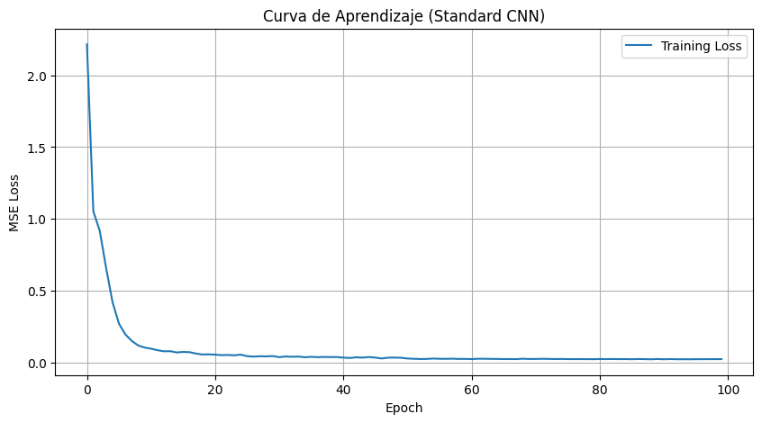
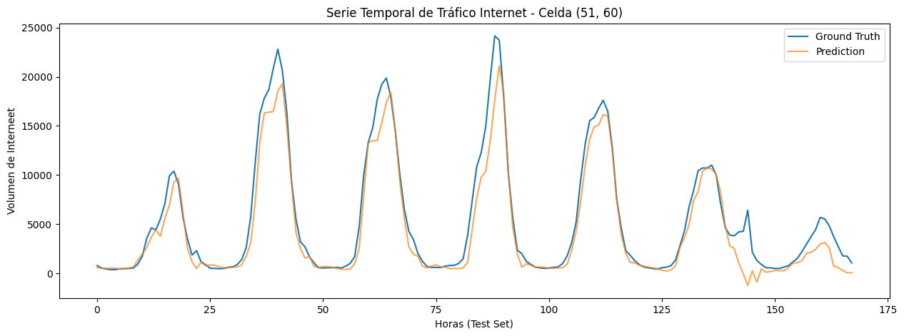
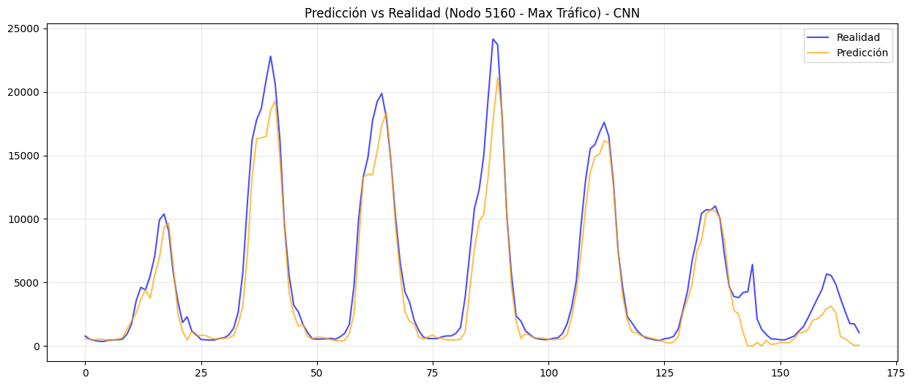
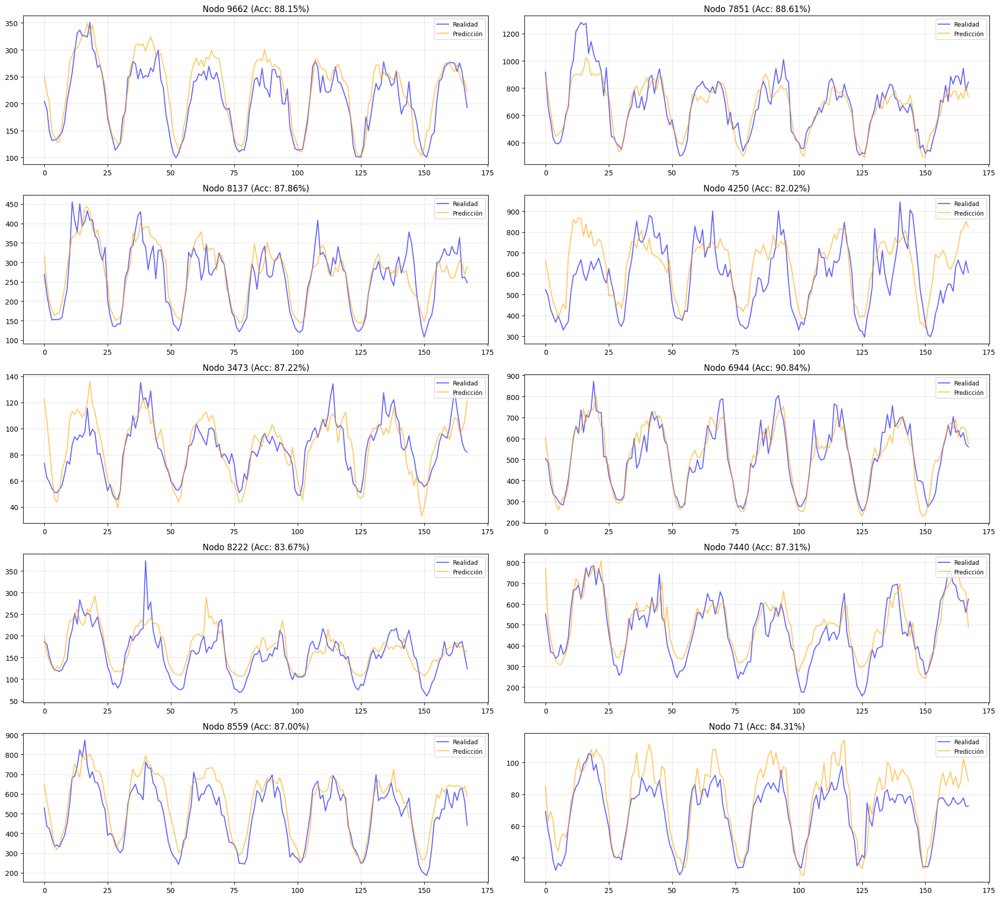
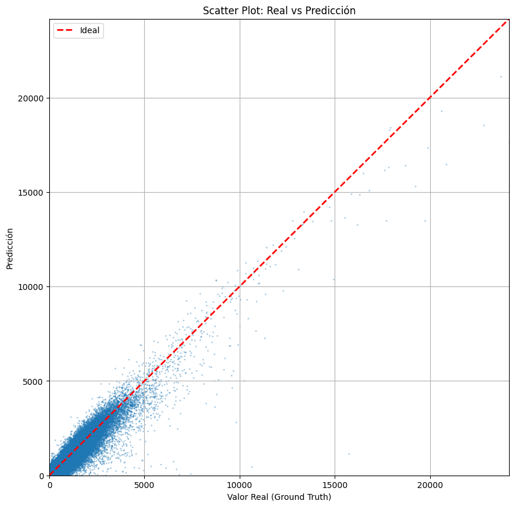

# Reporte de Visualizaciones: CNN_Internet

Este documento contiene las figuras extraídas del notebook `CNN_Internet.ipynb` con sus correspondientes explicaciones.

### Curvatura de Aprendizaje (Loss)

Muestra la evolución del error (MSE) durante el entrenamiento. Una curva descendente que se estabiliza indica que el modelo ha convergido correctamente.

---

### Visualización 2

Visualización de los resultados del modelo.

---

### Serie Temporal: Nodos Aleatorios

Aquí se presentan comparaciones para nodos seleccionados al azar. Esto permite verificar la consistencia del modelo en diferentes partes de la red, no solo en los puntos críticos, asegurando que no haya sobreajuste a los nodos principales.

---

### Serie Temporal: Nodos Aleatorios

Aquí se presentan comparaciones para nodos seleccionados al azar. Esto permite verificar la consistencia del modelo en diferentes partes de la red, no solo en los puntos críticos, asegurando que no haya sobreajuste a los nodos principales.

---

### Scatter Plot: Real vs Predicción

Este gráfico de dispersión enfrenta cada valor real contra su correspondiente predicción. La línea roja discontinua representa la predicción perfecta (y=x). La cercanía de los puntos a esta línea indica la precisión global del modelo; una nube de puntos estrecha sugiere un error bajo y alta correlación.

---
