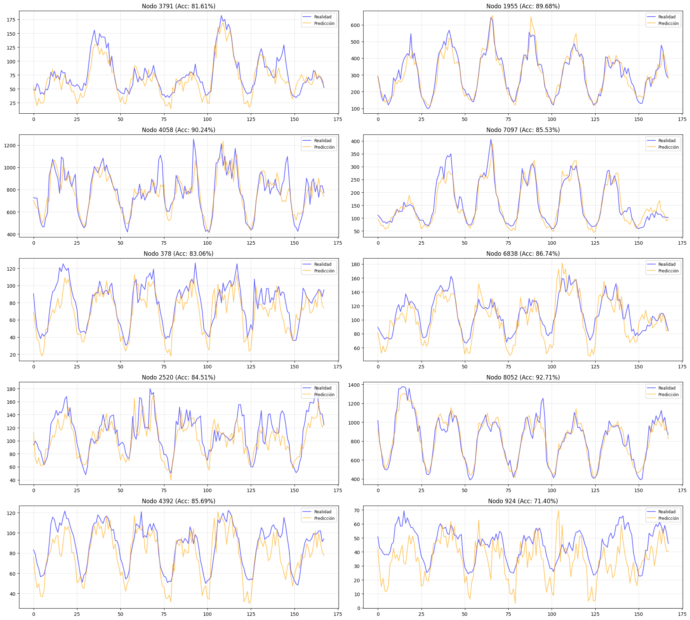
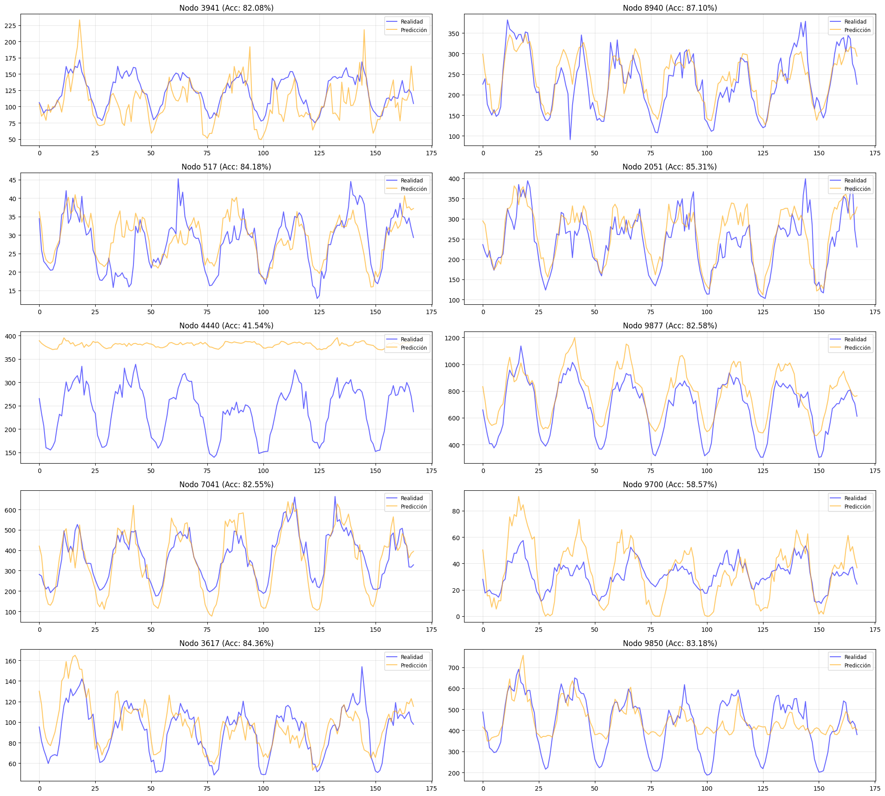
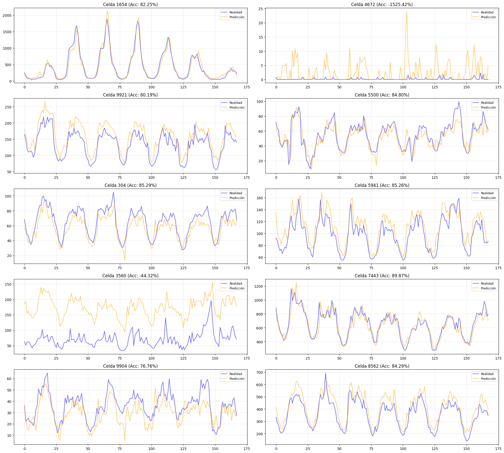
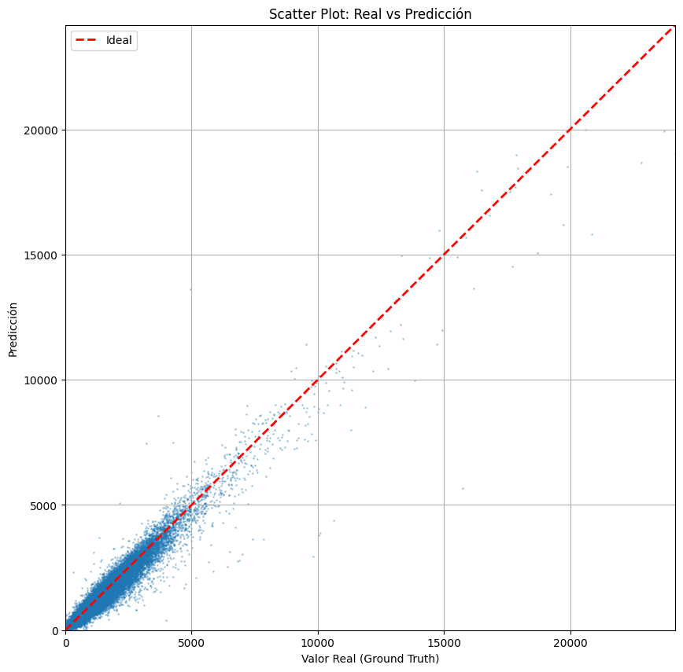
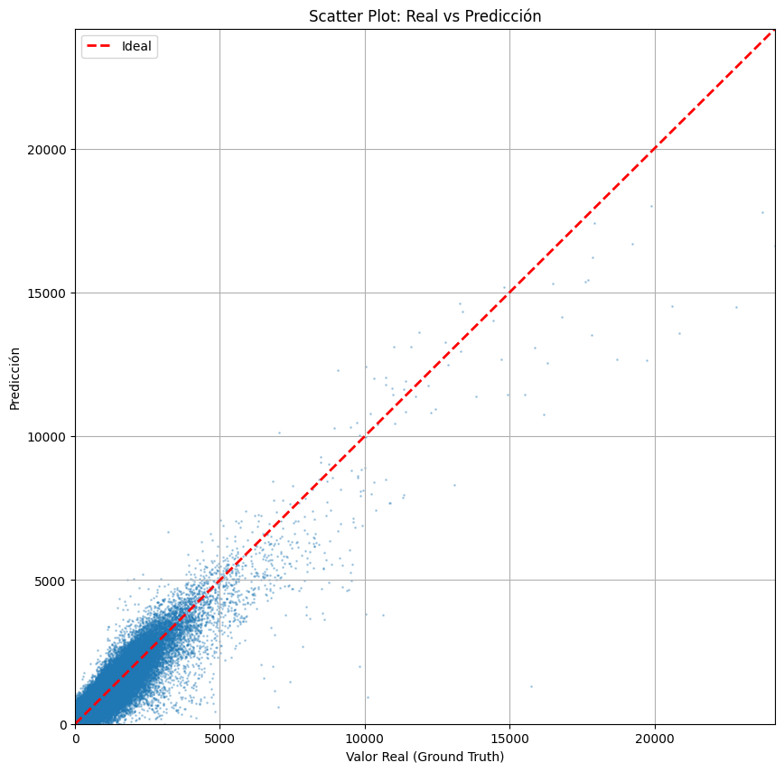
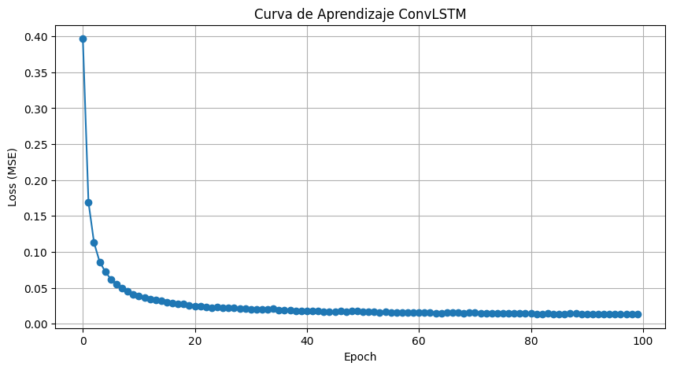
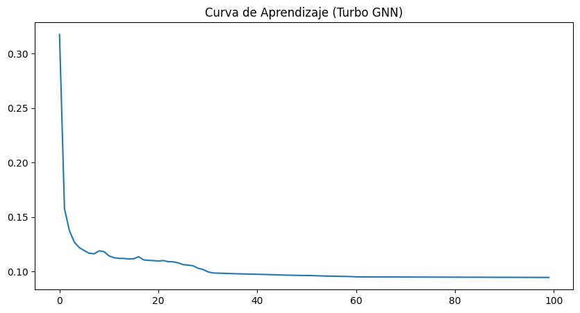
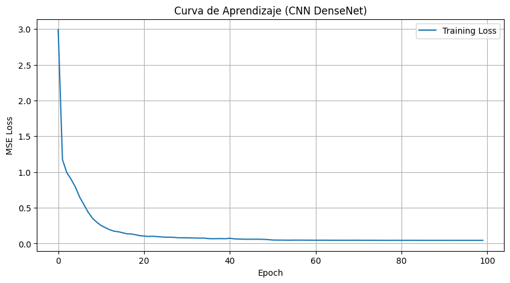

# Comparativa de Modelos de Predicción de Tráfico

Este reporte presenta una comparación detallada del rendimiento y eficiencia de los diferentes modelos implementados en el proyecto para la predicción de tráfico de Internet.

## 1. Métricas de Rendimiento

A continuación se detallan las métricas obtenidas por cada modelo tras el entrenamiento y la evaluación en el set de test.

| Modelo | Accuracy (1-WMAPE) | RMSE | MAE | R2 | WMAPE |
|:---|:---:|:---:|:---:|:---:|:---:|
| **GNN_Internet_Dense** | **90.37%** | **57.45** | **23.34** | **0.976** | **0.096** |
| **ConvLSTM** | 88.93% | 59.39 | 26.85 | 0.975 | 0.111 |
| **CNN_Internet** | 83.72% | 97.13 | 39.47 | 0.932 | 0.163 |
| **prediction_model_internet** | 83.21% | 103.34 | 40.70 | 0.921 | 0.168 |
| **GNN_Internet** | 79.28% | 128.85 | 50.22 | 0.880 | 0.207 |
| **CNN_Dense_Internet** | 78.07% | 118.96 | 53.16 | 0.898 | 0.219 |

---

## 2. Comparativa Visual: Series Temporales de 10 Nodos Aleatorios

La visualización de series temporales para nodos seleccionados aleatoriamente permite evaluar la capacidad de los modelos para capturar la dinámica temporal del tráfico en diferentes puntos de la red.

### Modelos de Alto Rendimiento (GNN & ConvLSTM)

| GNN Internet Dense | ConvLSTM |
|:---:|:---:|
|  |  |

### Modelos Base y CNN

| Prediction Model (Internet) | CNN Internet |
|:---:|:---:|
|  |  |

| CNN Dense Internet | GNN Internet (Baseline) |
|:---:|:---:|
|  |  |

### Análisis de Gráficos:
- **GNN_Internet_Dense & ConvLSTM:** Demuestran una capacidad superior para seguir las tendencias y picos de tráfico en nodos con comportamientos variados.
- **Modelos CNN y Base:** Aunque capturan la estacionalidad general, presentan mayores desviaciones en los picos de mayor demanda.

---

## 3. Comparativa Visual: Real vs Predicción (Scatter Plots)

El gráfico de dispersión permite evaluar la correlación entre los valores reales y las predicciones. Una alineación estrecha con la diagonal roja indica un modelo más preciso.

### Modelos de Alto Rendimiento (GNN & ConvLSTM)

| GNN Internet Dense | ConvLSTM |
|:---:|:---:|
|  |  |

### Modelos Base y CNN

| Prediction Model (Internet) | CNN Internet |
|:---:|:---:|
|  |  |

| CNN Dense Internet | GNN Internet (Baseline) |
|:---:|:---:|
|  |  |

---

## 4. Curvas de Pérdida (Convergencia)

La comparación de las curvas de *Loss* permite identificar la estabilidad del entrenamiento para todos los modelos.

| GNN Internet Dense | ConvLSTM | CNN Internet |
|:---:|:---:|:---:|
|  |  |  |

| Prediction Model | GNN Internet (Base) | CNN Dense Internet |
|:---:|:---:|:---:|
|  |  |  |

---

## 5. Conclusiones Finales

1.  **Ganador por Precisión:** El modelo **GNN_Internet_Dense** es el más robusto, alcanzando un **90.37% de Accuracy**.
2.  **Rendimiento Temporal:** **ConvLSTM** destaca por su capacidad para modelar dependencias temporales complejas.
3.  **Arquitectura:** La inclusión de conexiones residuo/compactas (**Dense**) mejora significativamente la estabilidad.