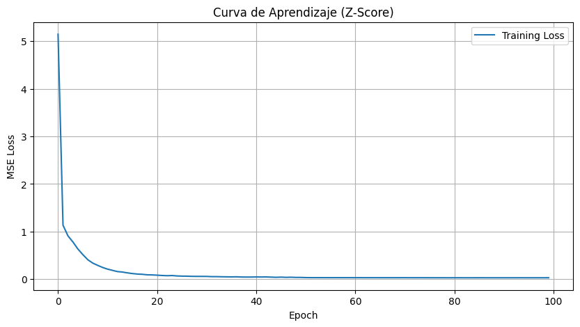
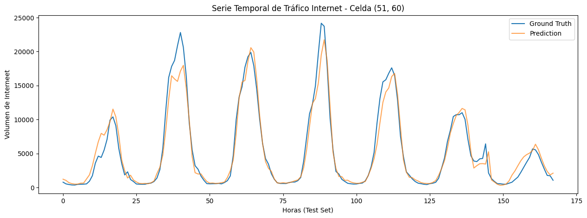
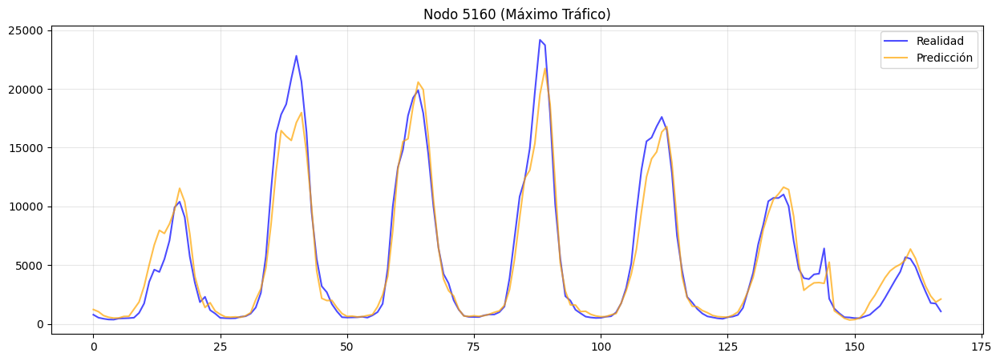
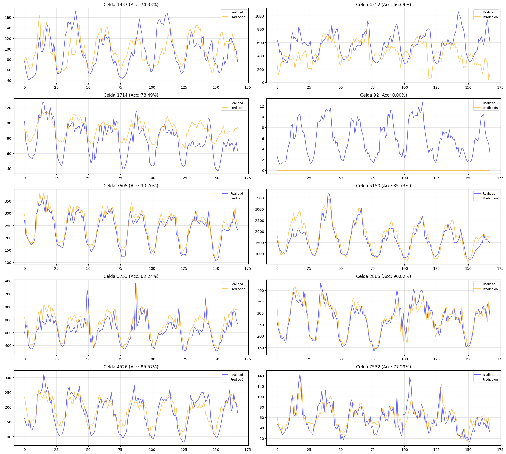
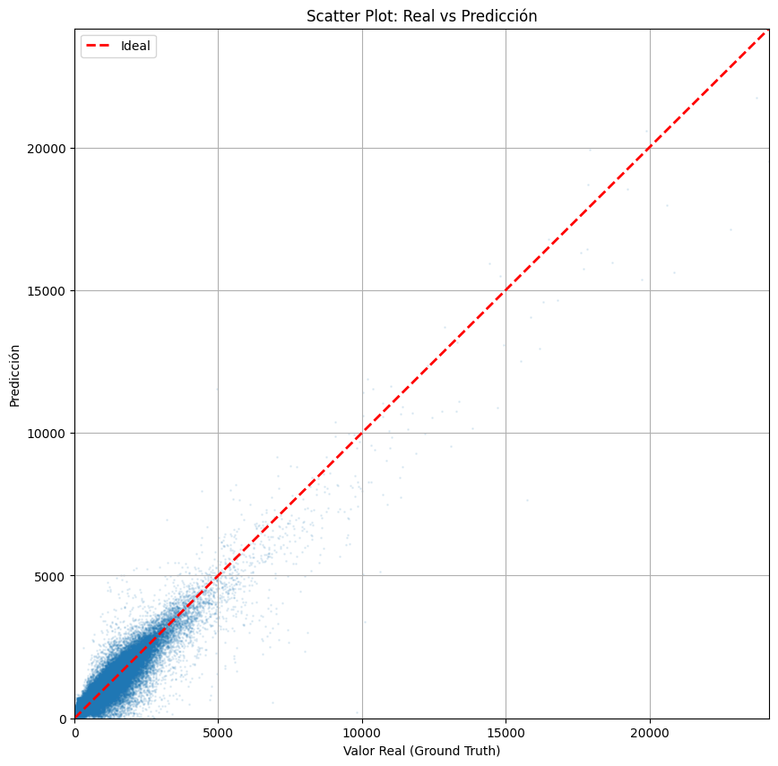

# Reporte de Visualizaciones: prediction_model_internet

Este documento contiene las figuras extraídas del notebook `prediction_model_internet.ipynb` con sus correspondientes explicaciones.

### Curvatura de Aprendizaje (Loss)

Muestra la evolución del error (MSE) durante el entrenamiento. Una curva descendente que se estabiliza indica que el modelo ha convergido correctamente.

---

### Visualización 2

Visualización de los resultados del modelo.

---

### Serie Temporal: Nodo de Mayor Tráfico

Esta gráfica muestra la comparación entre los datos reales (Ground Truth) y las predicciones del modelo para el nodo que registra el mayor volumen de tráfico promedio. Es una prueba crítica de la capacidad del modelo para capturar picos de demanda.

---

### Serie Temporal: Nodo de Mayor Tráfico

Esta gráfica muestra la comparación entre los datos reales (Ground Truth) y las predicciones del modelo para el nodo que registra el mayor volumen de tráfico promedio. Es una prueba crítica de la capacidad del modelo para capturar picos de demanda.

---

### Scatter Plot: Real vs Predicción

Este gráfico de dispersión enfrenta cada valor real contra su correspondiente predicción. La línea roja discontinua representa la predicción perfecta (y=x). La cercanía de los puntos a esta línea indica la precisión global del modelo; una nube de puntos estrecha sugiere un error bajo y alta correlación.

---
