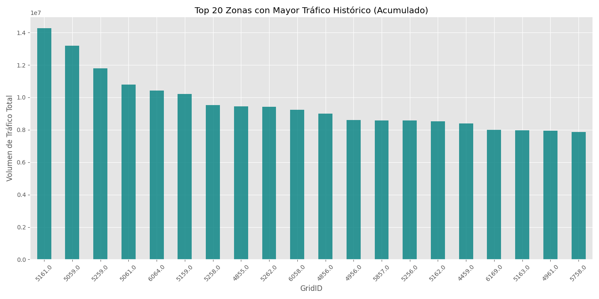
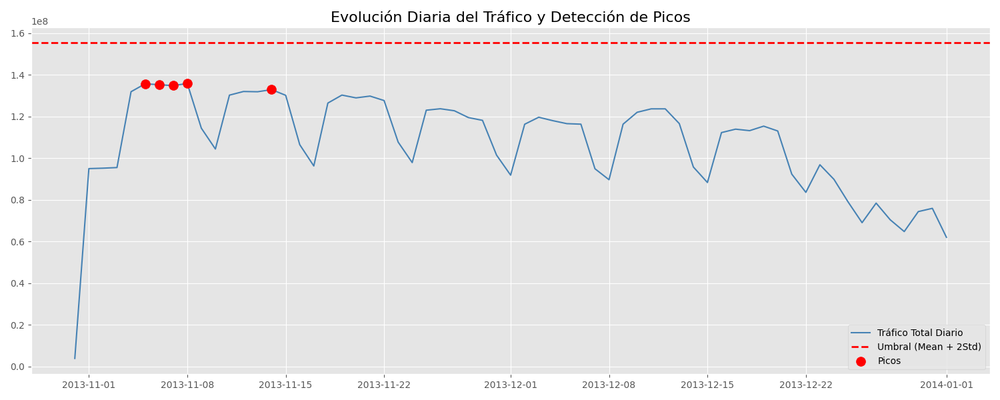
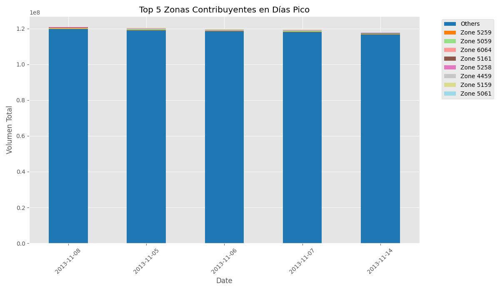
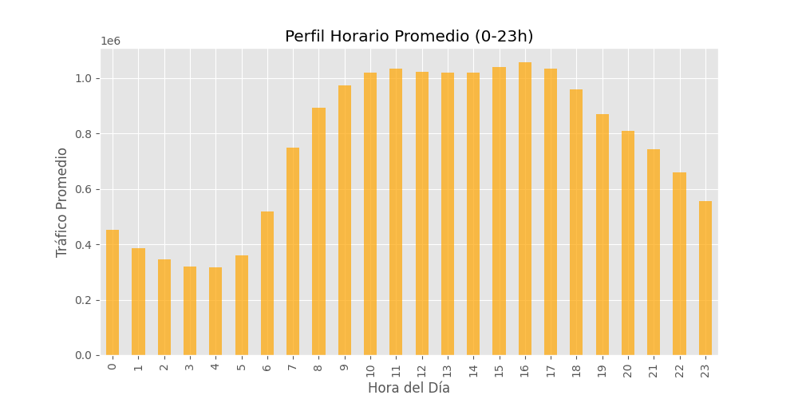
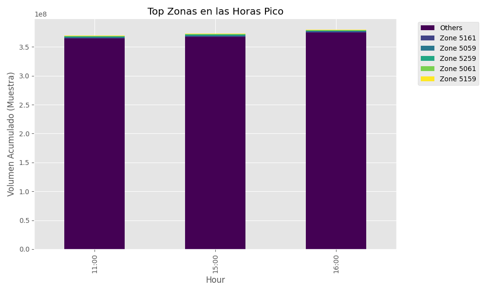

# Reporte de Análisis de Tráfico: Zonas, Días y Horas
Fecha: 2025-12-20 19:56:11

## 1. Top Zonas Históricas
Las zonas (GridID) que más tráfico han acumulado en todo el histórico.

## 2. Picos de Tráfico Diario
Evolución del tráfico diario total con umbral (Mean + 2*Std).
- **Umbral calculado**: 155,271,988
- **Días Pico**: 2013-11-08, 2013-11-05, 2013-11-06, 2013-11-07, 2013-11-14

## 3. Desglose de Zonas en Días Pico
¿Qué zonas contribuyeron más al tráfico en los días de mayor demanda?

## 4. Perfil Horario
Tráfico promedio por hora del día.

## 5. Top Zonas en Horas Pico
Zonas más activas durante las horas de mayor tráfico (16, 15, 11:00).

